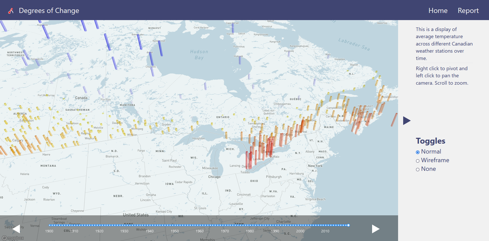
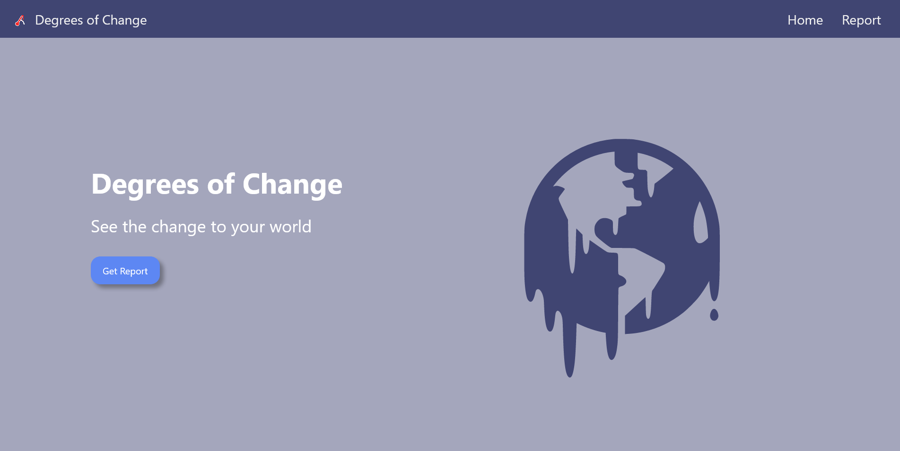

# Degrees of Change

As our climate change worsens we'll see many changes to our world, but what will it look like where you live? How will it affect your friend from Vancouver? This website allows you to explore the effects of climate change around Canada in 3D! 

## ✨ About

A React app that allows you to explore climate change around Canada in 3D! Users can manipulate the map interface to visualize the effects of climate change in one simple, user-friendly format! Check out the [devpost here](https://devpost.com/software/degrees-of-change)!

## 📸 Demo/Screenshots

## 🔨 Tools

* React-Typescript (Front end)

### Dependencies

* create-react-app
* rsuite
* react-router-dom
* react-map-gl
* deck.gl

Dataset provided by the [Government of Canada](https://climate-change.canada.ca/climate-data/#/adjusted-station-data)

## 👨‍👦‍👦 Team

* [Kevin](https://github.com/ViridianCitrus)
* [Ben](https://github.com/Xiaoyu-Ben-Wang) 
* [Andrew](https://github.com/Zeyu-Li)
* [Taha](https://github.com/MTahaK)

